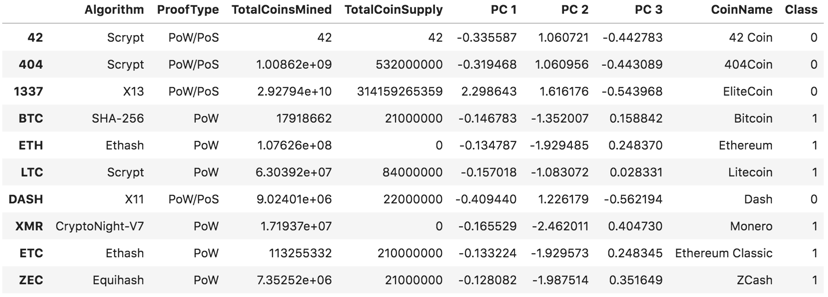

# Unit 13 Homework Assignment - The Power of the Cloud and Unsupervised Learning

### Before You Begin

1. Create a new repository for this project called `unit13-challenge`. **Do not add this homework to an existing repository**.

2. Clone the new repository to your computer.

3. Inside your local git repository, create a directory for the challenge assignment you choose. Use folder names corresponding to the challenges: **RoboAdvisor** or **ClusteringCrypto**.

4. Add your solution files to this folder.

5. Push the above changes to GitHub or GitLab.

## Clustering Crypto

_[Cryptocurrencies coins by Worldspectrum](https://www.pexels.com/@worldspectrum?utm_content=attributionCopyText&utm_medium=referral&utm_source=pexels) | [Free License](https://www.pexels.com/photo-license/)_

### Instructions

#### Data Preprocessing

In this section, you will load the information about cryptocurrencies and perform data preprocessing tasks. You can choose one of the following methods to load the data:

1. Using the provided `CSV` file, create a `Path` object and read the file data directly into a DataFrame named `crypto_df` using `pd.read_csv()`.

2. Using the following `requests` library, retreive the necessary data from the following API endpoint from _CryptoCompare_ - `https://min-api.cryptocompare.com/data/all/coinlist`. **HINT:** You will need to use the 'Data' key from the json response, then transpose the DataFrame. Name your DataFrame `crypto_df`.

With the data loaded into a Pandas DataFrame, continue with the following data preprocessing tasks.

3. Keep only the necessary columns: 'CoinName','Algorithm','IsTrading','ProofType','TotalCoinsMined','TotalCoinSupply'

4. Keep only the cryptocurrencies that are trading.

5. Keep only the cryptocurrencies with a working algorithm.

6. Remove the `IsTrading` column.

7. Remove all cryptocurrencies with at least one null value.

8. Remove all cryptocurrencies that have no coins mined.

9. Drop all rows where there are 'N/A' text values.

10. Store the names of all cryptocurrencies in a DataFrame named `coins_name`, use the `crypto_df.index` as the index for this new DataFrame.

11. Remove the `CoinName` column.

12. Create dummy variables for all the text features, and store the resulting data in a DataFrame named `X`.

13. Use the [`StandardScaler` from `sklearn`](https://scikit-learn.org/stable/modules/generated/sklearn.preprocessing.StandardScaler.html) to standardize all the data of the `X` DataFrame. Remember, this is important prior to using PCA and K-Means algorithms.

#### Reducing Data Dimensions Using PCA

Use the [`PCA` algorithm from `sklearn`](https://scikit-learn.org/stable/modules/generated/sklearn.decomposition.PCA.html) to reduce the dimensions of the `X` DataFrame down to three principal components.

Once you have reduced the data dimensions, create a DataFrame named `pcs_df` using as columns names `"PC 1", "PC 2"` and `"PC 3"`; use the `crypto_df.index` as the index for this new DataFrame.

You should have a DataFrame like the following:

#### Clustering Cryptocurrencies Using K-Means

In this section, you will use the [`KMeans` algorithm from `sklearn`](https://scikit-learn.org/stable/modules/generated/sklearn.cluster.KMeans.html) to cluster the cryptocurrencies using the PCA data.

Perform the following tasks:

1. Create an Elbow Curve to find the best value for `k` using the `pcs_df` DataFrame.

2. Once you define the best value for `k`, run the `Kmeans` algorithm to predict the `k` clusters for the cryptocurrencies data. Use the `pcs_df` to run the `KMeans` algorithm.

3. Create a new DataFrame named `clustered_df`, that includes the following columns `"Algorithm", "ProofType", "TotalCoinsMined", "TotalCoinSupply", "PC 1", "PC 2", "PC 3", "CoinName", "Class"`. You should maintain the index of the `crypto_df` DataFrames as is shown bellow.

   

#### Visualizing Results

In this section, you will create some data visualization to present the final results. Perform the following tasks:

1. Create a scatter plot using `hvplot.scatter`, to present the clustered data about cryptocurrencies having `x="TotalCoinsMined"` and `y="TotalCoinSupply"` to contrast the number of available coins versus the total number of mined coins. Use the `hover_cols=["CoinName"]` parameter to include the cryptocurrency name on each data point.

2. Use `hvplot.table` to create a data table with all the current tradable cryptocurrencies. The table should have the following columns: `"CoinName", "Algorithm", "ProofType", "TotalCoinSupply", "TotalCoinsMined", "Class"`
